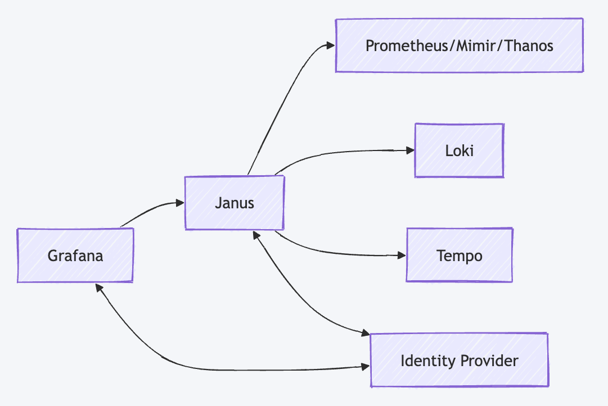
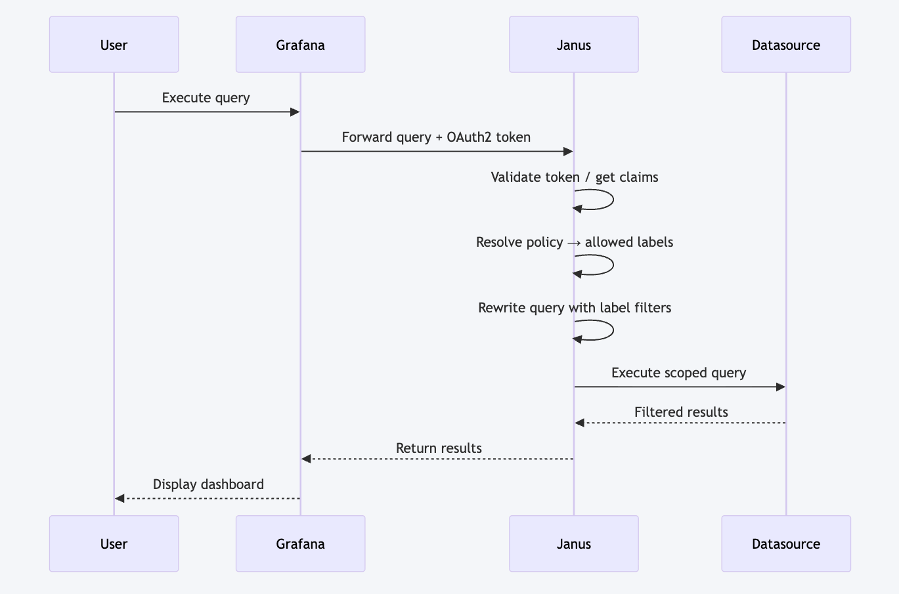

# Janus - Multi-tenant Observability Proxy

[](https://openjdk.java.net/)
[](https://spring.io/projects/spring-boot)
[](LICENSE)
[](https://github.com/evoila/janus/actions/workflows/ci.yml)
[](https://github.com/evoila/janus/actions/workflows/build-image.yml)


Janus is a **multi-tenant observability proxy** that provides **label-based access control** and **query enforcement** for Prometheus, Loki, and Tempo. It acts as a security layer between users and your observability stack, ensuring that users can only access data they're authorized to see.


## ✨ What Janus Does

### Core Functionality
- **Multi-tenant Access Control**: Enforces tenant isolation using JWT tokens and header-based authentication
- **Label-based Security**: Controls access to observability data based on labels (namespace, service, pod, etc.)
- **Query Enforcement**: Automatically enhances and validates queries to ensure compliance with access policies
- **Proxy Layer**: Transparently forwards requests to Prometheus (via Thanos), Loki, and Tempo
- **High Performance**: Built with Spring WebFlux for reactive, non-blocking I/O

### Supported Observability Tools
- **Prometheus/Thanos**: Metrics queries and range queries
- **Loki**: Log queries with LogQL
- **Tempo**: Distributed tracing with TraceQL

## 📦 Container Images

Pre-built container images are available from the GitHub Container Registry:

```bash
docker pull ghcr.io/evoila/janus:latest
```

Janus uses [semantic versioning](https://semver.org/). The following tags are available:

| Tag | Example | Description |
|-----|---------|-------------|
| `latest` | `ghcr.io/evoila/janus:latest` | Latest release |
| `<major>` | `ghcr.io/evoila/janus:0` | Latest release within a major version |
| `<major>.<minor>` | `ghcr.io/evoila/janus:0.1` | Latest release within a minor version |
| `<major>.<minor>.<patch>` | `ghcr.io/evoila/janus:0.1.0` | Specific release |
| `sha-<short-sha>` | `ghcr.io/evoila/janus:sha-0257f1f` | Specific commit |

## 🏗️ Architecture



## 🔄 Request-Response Flow



## 📋 Configuration

### Environment Variables

| Variable | Default | Description |
|----------|---------|-------------|
| `SPRING_PROFILES_ACTIVE` | `all` | Spring profile to activate (see profiles section below) |
| `LOKI_URL` | `http://localhost:8081` | Loki service URL |
| `THANOS_URL` | `http://localhost:10902` | Thanos/Prometheus URL |
| `TEMPO_URL` | `http://localhost:3100` | Tempo service URL |
| `LABEL_STORE_TYPE` | `configmap` | Label store type (`config` or `configmap`) |
| `LABEL_STORE_CONFIGMAP_PATH` | `./local-configmap.yaml` | Path to ConfigMap file |
| `OAUTH2_ISSUER_URI` | Keycloak URL | OAuth2 issuer URI |
| `OAUTH2_JWK_SET_URI` | Keycloak JWKS URL | OAuth2 JWK Set URI for token validation |
| `OAUTH2_CUSTOM_CA_PATH` | *(empty)* | Path to custom CA certificate for OAuth2/Keycloak SSL connections |

### OpenTelemetry Configuration (Not Active)

Janus includes OpenTelemetry configuration in `application.yml`, but **tracing is not currently active**. The previous implementation using the OpenTelemetry Java Agent has been removed. Tracing may be reimplemented using the OpenTelemetry SDK in a future release.

| Variable | Default | Description |
|----------|---------|-------------|
| `OTEL_SERVICE_NAME` | `janus` | Service name for telemetry |
| `OTEL_EXPORTER_OTLP_ENDPOINT` | `http://localhost:4317` | OTLP exporter endpoint |
| `OTEL_EXPORTER_OTLP_PROTOCOL` | `grpc` | OTLP protocol (grpc/http) |

### Spring Profiles

Janus supports different deployment modes through Spring profiles. Each profile starts only the specified service:

| Profile | Description | Port | Service |
|---------|-------------|-------|---------|
| `all` | **Default**: Starts all services (Loki, Thanos, Tempo) | `8080` | Complete proxy |
| `loki` | Starts only Loki proxy service | `8081` | Loki only |
| `thanos` | Starts only Thanos/Prometheus proxy service | `8083` | Thanos only |
| `tempo` | Starts only Tempo proxy service | `8085` | Tempo only |

#### Profile Usage Examples

```bash
# Start all services (default)
./mvnw spring-boot:run

# Start only Loki proxy
SPRING_PROFILES_ACTIVE=loki ./mvnw spring-boot:run

# Start only Thanos proxy
SPRING_PROFILES_ACTIVE=thanos ./mvnw spring-boot:run

# Start only Tempo proxy
SPRING_PROFILES_ACTIVE=tempo ./mvnw spring-boot:run

# Using JAR file
java -jar target/janus-0.0.1-SNAPSHOT.jar --spring.profiles.active=loki
```

#### Profile-Specific Configuration

Each profile has its own configuration in `application.yml`:

```yaml
---
# Profile for running all services together (monolithic)
spring:
  config:
    activate:
      on-profile: all
server:
  port: 8080

---
# Profile for running only Loki service
spring:
  config:
    activate:
      on-profile: loki
server:
  port: 8081

---
# Profile for running only Thanos service
spring:
  config:
    activate:
      on-profile: thanos
server:
  port: 8083

---
# Profile for running only Tempo service
spring:
  config:
    activate:
      on-profile: tempo
server:
  port: 8085
```

### Application Configuration

The main configuration is in `src/main/resources/application.yml`:

```yaml
proxy:
  config:
    enforcement:
      enabled: true
      tenant-claim: groups
      skip-for-admins: true
      admin-group: admin

  services:
    loki:
      url: ${LOKI_URL:http://localhost:8081}
      type: logql
    thanos:
      url: ${THANOS_URL:http://localhost:10902}
      type: promql
    tempo:
      url: ${TEMPO_URL:http://localhost:3100}
      type: traceql
```

## 🏷️ Label Configuration Logic

### ConfigMap Structure

Janus uses a hierarchical configuration system defined in a ConfigMap (or local YAML file):

```yaml
# Global admin access
admin:
  labels:
    - "*"
  header:
    - X-Scope-OrgID: tenant1
  cluster-wide: []

# Service-specific configurations
thanos:
  tenant-header-constraints:
    order-service-team:
      header:
        - X-Scope-OrgID: tenant1
  user-label-constraints:
    order-service-team:
      labels:
        - "*"
      namespace:
        - demo
      service:
        - "~.+"
```

### Label Enforcement Process

1. **Request Reception**: Janus receives queries from clients (e.g., Grafana)
2. **Authentication**: Validates JWT tokens and extracts tenant information
3. **Label Extraction**: Parses the query to identify labels and constraints
4. **Policy Lookup**: Finds applicable policies based on tenant and service type
5. **Query Enhancement**: Automatically adds required labels to ensure compliance
6. **Validation**: Verifies that the enhanced query meets access requirements
7. **Forwarding**: Sends the enhanced query to the backend service

### Label Configuration Flexibility

Janus supports **any labels** that your observability stack uses. The labels and their allowed values are **fully configurable** through the ConfigMap. Here are some common examples:

#### Common Label Examples

**Prometheus/Thanos (Metrics)**
```yaml
thanos:
  user-label-constraints:
    team-a:
      labels:
        - namespace
        - service
        - pod
        - instance
        - job
        - environment
        - region
      namespace:
        - "team-a-namespace"
        - "shared-namespace"
      environment:
        - "production"
        - "staging"
```

**Loki (Logs)**
```yaml
loki:
  user-label-constraints:
    team-b:
      labels:
        - k8s_namespace_name
        - service_name
        - pod_name
        - container_name
        - log_level
        - application
      k8s_namespace_name:
        - "team-b-namespace"
      log_level:
        - "ERROR"
        - "WARN"
```

**Tempo (Traces)**
```yaml
tempo:
  user-label-constraints:
    team-c:
      labels:
        - resource.service.name
        - resource.namespace
        - resource.pod.name
        - span.kind
        - http.method
      resource.service.name:
        - "api-service"
        - "web-service"
```

#### Key Points About Label Configuration

- **Dynamic**: Labels are not hardcoded - you can configure any label your observability stack uses
- **Flexible Values**: Support for exact matches, regex patterns, and wildcards
- **Service-Specific**: Different label sets can be configured for each service (Prometheus, Loki, Tempo)
- **Tenant-Based**: Different teams/tenants can have different label access policies
- **Runtime Updates**: ConfigMap changes are automatically detected and applied without restart

### Wildcard and Pattern Matching

Janus supports powerful wildcard and pattern matching features for flexible access control:

#### Global Label Access (`labels: ["*"]`)
```yaml
admin:
  labels:
    - "*"  # Allows access to ALL labels without restrictions
```
This configuration grants **unrestricted access** to all labels. Users can query any label without enforcement.

#### Wildcard Patterns in Values
```yaml
thanos:
  user-label-constraints:
    system-team:
      labels:
        - "*"  # All labels allowed
      service:
        - "*"  # Any service name
      namespace:
        - "*-system-*"    # Namespaces containing "system"
        - "ingress-nginx"  # Exact match
        - "otel-*"         # Namespaces starting with "otel"
        - "*-controller"   # Namespaces ending with "controller"
```

#### Pattern Matching Examples

| Pattern | Description | Examples |
|---------|-------------|----------|
| `"*"` | Any value (wildcard) | `service`, `pod`, `namespace` |
| `"*-system-*"` | Contains "system" (wildcard) | `my-system-app`, `system-monitoring` |
| `"otel-*"` | Starts with "otel" (wildcard) | `otel-collector`, `otel-agent` |
| `"*-controller"` | Ends with "controller" (wildcard) | `kube-controller`, `app-controller` |
| `"~.+"` | Regex: one or more characters | Any non-empty value |
| `"~.*"` | Regex: zero or more characters | Any value (including empty) |
| `"~5.."` | Regex: starts with "5" | `500`, `501`, `502` |

#### Advanced Pattern Examples
```yaml
loki:
  user-label-constraints:
    monitoring-team:
      labels:
        - "*"
      k8s_namespace_name:
        - "prod-*"        # Production namespaces
        - "staging-*"     # Staging namespaces
        - "monitoring"    # Exact match
      log_level:
        - "ERROR"
        - "WARN"
        - "INFO"
      application:
        - "*-api"         # API applications
        - "web-*"         # Web applications
        - "backend-*"     # Backend services
```

#### Pattern Matching Operators

Janus supports different operators for label matching:

- **`=`** (equals): Exact match
- **`=~`** (regex match): Pattern matching
- **`!=`** (not equals): Exclude exact value
- **`!~`** (regex not match): Exclude pattern

```yaml
# Examples with operators
thanos:
  user-label-constraints:
    team-a:
      namespace:
        - "demo"          # namespace="demo"
        - "prod-*"        # namespace=~"prod-.*"
      status:
        - "!~5.."         # status!~"5.." (exclude 5xx errors - prefix notation)
        - "!=error"       # status!="error" (prefix notation)
```

#### Explicit Regex Patterns (`~` Prefix)

For complex regex patterns with anchors (`^`, `$`), character classes (`[a-z]`), or other advanced regex features, use the `~` prefix to mark values as explicit regex patterns:

```yaml
thanos:
  user-label-constraints:
    # Team with access to services matching complex patterns
    regex-team:
      labels:
        - "*"
      namespace:
        - "~^[a-z]+-service$"    # Matches: order-service, payment-service
        - "~^demo-.*$"           # Matches: demo-app, demo-api, demo-service
        - "~.*-production$"      # Matches: app-production, api-production

    # Multi-pattern access (union of patterns)
    multi-access-team:
      labels:
        - "*"
      namespace:
        - "~^demo.*$"            # Starts with "demo"
        - "~.*-service$"         # Ends with "-service"
```

**Key differences between wildcards and explicit regex:**

| Config Value | Type | Stored As | Query Generated |
|--------------|------|-----------|-----------------|
| `"demo"` | Exact match | `demo` | `namespace="demo"` |
| `"demo-*"` | Wildcard | `demo-*` | `namespace=~"demo-.*"` |
| `"~^demo.*$"` | Explicit regex | `^demo.*$` | `namespace=~"^demo.*$"` |
| `"~^[a-z]+-service$"` | Explicit regex | `^[a-z]+-service$` | `namespace=~"^[a-z]+-service$"` |

> **Note:** Values with `~` prefix must be quoted in YAML. The `~` is stripped during config loading and the remaining pattern is used as-is in queries.

## 🔧 Setup and Installation

### Prerequisites
- Java 25 or higher
- Maven 3.9+
- Access to Prometheus/Thanos, Loki, and Tempo services

### Quick Start

1. **Clone and Build**
   ```bash
   git clone https://github.com/evoila/janus.git
   cd janus
   ./mvnw clean package
   ```

2. **Configure Services**
   ```bash
   # Copy the example configuration
   cp config-example.yaml ./local-configmap.yaml
   # Edit the file to match your environment
   ```

3. **Run Janus**
   ```bash
   # Run as JAR
   java -jar target/janus-0.0.1-SNAPSHOT.jar
   
   # Or run with Maven
   ./mvnw spring-boot:run
   ```

4. **Test the Setup**
   ```bash
   # Health check
   curl http://localhost:8080/actuator/health

   # Test query with GET (most common)
   curl "http://localhost:8080/api/v1/query?query=up" \
     -H "Authorization: Bearer YOUR_JWT_TOKEN"

   # Test query with POST (for long queries)
   curl -X POST http://localhost:8080/api/v1/query \
     -H "Authorization: Bearer YOUR_JWT_TOKEN" \
     -H "Content-Type: application/x-www-form-urlencoded" \
     -d "query=up"
   ```

### Docker Deployment

```bash
# Build native image
./mvnw -Pnative native:compile

# Run with Docker
docker build -f Dockerfile.native-build -t janus .
docker run -p 8080:8080 janus
```


## 🔒 Security Features

### Authentication
- **JWT Token Validation**: Validates OAuth2 JWT tokens
- **Tenant Extraction**: Extracts tenant information from JWT claims
- **Header-based Routing**: Uses custom headers for tenant identification

### Authorization
- **Label-based Access Control**: Controls access based on data labels
- **Query Enforcement**: Automatically enhances queries with required labels
- **Admin Bypass**: Allows admin users to bypass restrictions
- **Wildcard Support**: Supports regex patterns for flexible matching

### Audit and Monitoring
- **Request Logging**: Logs all incoming requests and responses
- **Query Enhancement Tracking**: Tracks how queries are modified
- **Performance Metrics**: Exposes metrics via Prometheus endpoint

## 🧪 Testing

### Test Coverage

Janus includes comprehensive test coverage:

- **Unit Tests**: Core logic, query parsing, label enforcement
- **Integration Tests**: WireMock-based tests against simulated Prometheus/Thanos, Loki, and Tempo backends
- **E2E Tests**: Full request/response cycle testing with realistic configurations

### Production Compatibility

| Backend             | Tested       | Notes                                    |
|---------------------|--------------|------------------------------------------|
| **Prometheus**      | ✅ Automated | E2E tests + production usage             |
| **Loki**            | ✅ Automated | E2E tests + production usage             |
| **Tempo**           | ✅ Automated | E2E tests + production usage             |
| **Thanos**          | ⚠️ Manual   | Production usage (Prometheus-compatible) |
| **Mimir**           | ❌ Untested  | Should work (Prometheus-compatible API)  |
| **VictoriaMetrics** | ❌ Untested  | Should work (Prometheus-compatible API)  |

Janus is actively used in multiple production environments with Thanos, Loki, and Tempo. Mimir and VictoriaMetrics use Prometheus-compatible APIs and should work without modifications, but are not part of our test suite.

> **Note:** Thanos is not included in automated E2E tests due to its API compatibility with Prometheus (making separate tests redundant) and the complexity of its multi-component architecture for test environments.

### Running Tests

```bash
# Run all tests
./mvnw test

# Run only unit tests
./mvnw test -DexcludedGroups=e2e

# Run only E2E tests
./mvnw test -Dgroups=e2e
```

### Manual Testing
```bash
# Test simple query (GET)
curl "http://localhost:8080/api/v1/query?query=up" \
  -H "Authorization: Bearer YOUR_TOKEN"

# Test range query (GET)
curl "http://localhost:8080/api/v1/query_range?query=up&start=1234567890&end=1234567899&step=15s" \
  -H "Authorization: Bearer YOUR_TOKEN"

# Test query with labels (GET - URL encoded)
curl "http://localhost:8080/api/v1/query?query=http_requests_total%7Bnamespace%3D%22demo%22%7D" \
  -H "Authorization: Bearer YOUR_TOKEN"

# Test with POST (for long/complex queries)
curl -X POST http://localhost:8080/api/v1/query \
  -H "Authorization: Bearer YOUR_TOKEN" \
  -H "Content-Type: application/x-www-form-urlencoded" \
  -d 'query=sum(rate(http_requests_total{namespace="demo"}[5m]))'
```


## 🔧 Development

### Project Structure
```
src/
├── main/java/com/evoila/janus/
│   ├── app/                    # Application configuration
│   ├── common/                 # Shared components
│   │   ├── config/            # Configuration classes
│   │   ├── controller/        # Base controllers
│   │   ├── enforcement/       # Label enforcement logic
│   │   ├── labelstore/        # Label configuration storage
│   │   ├── pipeline/          # Request processing pipeline
│   │   └── service/           # Core services
│   ├── loki/                  # Loki-specific components
│   ├── proxy/                 # HTTP client configuration
│   ├── security/              # Security configuration
│   ├── tempo/                 # Tempo-specific components
│   └── thanos/                # Thanos-specific components
└── test/                      # Test resources
```

### Building
```bash
# Compile
./mvnw compile

# Package
./mvnw package

# Run tests
./mvnw test

# Format code
./mvnw spotless:apply
```

### Code Quality
- **SonarQube**: Static code analysis
- **Spotless**: Code formatting with Google Java Format
- **JaCoCo**: Code coverage reporting

## 🤝 Contributing

1. Fork the repository
2. Create a feature branch
3. Make your changes
4. Add tests for new functionality
5. Ensure all tests pass
6. Submit a pull request

## 📄 License

This project is licensed under the [GNU Affero General Public License v3.0 (AGPLv3)](LICENSE.md).

## 💬 Support

For issues and questions:
- Create an issue in the repository
- Check the documentation
- Review the configuration examples

---

**Janus** - Secure your observability stack with confidence!

---

*Why "Janus"? Every observability tool seems to be named after a god Prometheus, Loki, Thanos. We needed a gatekeeper, so we went with the [Roman god of doorways and gates](https://en.wikipedia.org/wiki/Janus). Plus, he has two faces, which felt appropriate for a proxy that sees both sides of every request.*
